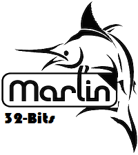

# Marlin4AZOR 3D Printer Firmware

_______
This Repository contains the Marlin firmware modified to be used with [AZOR 1.0](https://github.com/didix21/AZOR) boards. The main characteristics of this Marlin is that is ready to use with 32-bits MCU like **ATSAM3X8E**. The MCU which is used with [Arduino DUE](https://www.arduino.cc/en/Main/ArduinoBoardDue). 

## About it

Marlin4AZOR is a opensource beta firmware to be used exclusively with [AZOR 1.0](https://github.com/didix21/AZOR) electronic boards. I suggest don not use it with any other board because important modifications have been done to make it work with [SAM3X8E MCU](http://www.atmel.com/devices/ATSAM3X8E.aspx).

This project is based on work done by [Wurstnase](https://github.com/Wurstnase) with [Marlin4Due](https://github.com/Wurstnase/Marlin4Due). 

Marlin4AZOR has been created in collaboration with [JFonS](https://github.com/JFonS).

## Release

"The stable release is AZOR 1.0 that you will find in Release branch"(Not Yet).

## Recent Changes

No recent changes have been done.

## Main Features

The main features of this marlin are:

- Support for 32-bits MCU.
- Implemented M408: Report JSON-style response.
- Support for USB Stick.
- Support for PTS-Panel.

## Requirements
IMPORTANT!
To compile this project it will be necessary to use [Arduino](https://www.arduino.cc) version 1.6.0 or later.
To compile the program will be needed the following libraries:
- **UsbFat**
  - Download or clone from here: https://github.com/didix21/UsbFat
  - The **UsbFat** has been created by [greiman](https://github.com/greiman). if you want more information about the library I suggest to visit the [original repository](https://github.com/greiman/UsbFat).

- **Usb_Host_Shield_2.0**
  - Download or clone from here: https://github.com/didix21/USB_Host_Shield_2.0.
  - The original USB_Host_Shield_2.0 can be found [HERE](https://github.com/felis/USB_Host_Shield_2.0). ** IMPORTANT ** If you want to use it for AZOR download from the first link.

if you know how git works I recommend to clone both of them. Possible modifications will be needed in future.

## About AZOR 1.0

AZOR 1.0 is an open board created by [Presolid S.L](http://presolid.com/es/).

- [Bulding Files]
___________

## How to upload to AZOR 1.0

## License

Marlin is published under the [GPL license](/Documentation/License/GPL.md).

